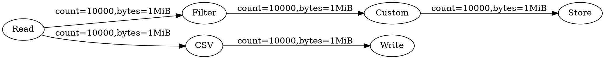
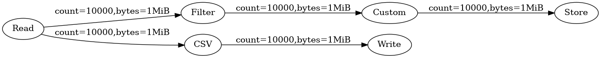

# selina


[](https://goreportcard.com/report/github.com/licaonfee/selina)
[](https://coveralls.io/github/licaonfee/selina?branch=master)
[](https://pkg.go.dev/github.com/licaonfee/selina?tab=doc)

Simple Pipeline for go, inspired on ratchet <https://github.com/dailyburn/ratchet>

Unstable API, please use go modules

- [selina](#selina)
  - [Installation](#installation)
  - [Usage](#usage)
  - [Graphviz](#graphviz)
  - [Builtin workers](#builtin-workers)
  - [Design](#design)
    - [Pipeline](#pipeline)
    - [Node](#node)
    - [Worker](#worker)
    - [Codec](#codec)
  - [Command line Usage](#command-line-usage)
  - [Autocompletion](#autocompletion)
    - [Get json-shema](#get-json-shema)
    - [VIM](#vim)
    - [VSCode](#vscode)

## Installation

```bash
go get github.com/licaonfee/selina
```

## Usage

```go
package main

import (
    "fmt"
    "os"
    "strings"
    "context"

    "github.com/licaonfee/selina"
    "github.com/licaonfee/selina/workers/regex"
    "github.com/licaonfee/selina/workers/text"
)

const sample = `this is a sample text
this is second line
#lines started with # will be skipped
this line pass`

func main() {
    rd := strings.NewReader(sample)
    input := selina.NewNode("Read", text.NewReader(text.ReaderOptions{Reader: rd}))
    //https://regex101.com/r/7ZS3Uw/1
    filter := selina.NewNode("Filter", regex.NewFilter(regex.FilterOptions{Pattern: "^[^#].+"}))
    output := selina.NewNode("Write", text.NewWriter(text.WriterOptions{Writer: os.Stdout}))
    pipe := selina.NewSimplePipeline(input, filter, output)
    if err := pipe.Run(context.Background()); err != nil {
        fmt.Printf("ERR: %v\n", err)
    }
    for name, stat := range pipe.Stats(){
        fmt.Printf("Node:%s=%v\n", name, stat)
    }
}
```

## Graphviz

Optionally you can render a graph of your pipeline

```go
func main(){
    // here pipeline is built
    p := selina.FreePipeline(read,filter,write,store,custom,csv)
    selina.Graph(p, os.Stdout)
}
```

With te previous code you get a .dot graph



Renderized with graphviz



## Builtin workers

By default selina has this workers implemented

- csv.Encoder : Transform data from json to csv
- csv.Decoder : Transform csv data into json
- custom.Function : Allow to execute custom functions into a pipeline node
- ops.Cron : Allow scheduled messages into a pipeline
- random.Random : Generate random byte slices
- regex.Filter : Filter data using a regular expresion
- remote.Server : Listen for remote data
- remote.Client : Send data to a remote pipeline
- sql.Reader : Execute a query against a database and return its rows as json objects
- sql.Writer : Insert rows into a table from json objects
- text.Reader : Use any io.Reader and read its contents as text
- text.Writer : Write text data into any io.Writer
- filesystem.Reader : Use afero.Fs to read arbitrary files
- filesystem.Writer : Use afero.Fs to write to arbitrary files

## Design

Selina have three main components

- Pipeline
- Node
- Worker

Some utility functions are provided to build pipelines, ```LinealPipeline(n ... Node)*Pipeliner``` chain all nodes in same order as their are passed. ```FreePipeline(n ...Node)*Pipeliner``` Just runs all nodes without chain them so you can build any pipeline, including ciclic graphs or aciclic graphs

### Pipeline

Start data processing and manage all chained nodes in a single object

### Node

Contains methods to pass data from Worker to Worker and get metrics

### Worker

All data Extraction/Transformation/Load logic is encapsulated in a Worker instance

### Codec

Most of workers receive an optional configuration `Codec` that implements ``Marshaler``/``Unmarshaler`` interfaces, by default [msgpack](https://msgpack.org/)  is used if no `Codec` is provided

## Command line Usage

Binary

```bash
selina -file pipeline.yml -timeout 10h
```

Docker

```bash
#all paths are relatives to /app/selina
#you can also use absolute paths
docker run -v$PWD:/data/sample:ro licaonfee/selina:rolling -f /data/pipeline.yml
```

Where pipeline.yml is

```yaml
---
nodes:
  - name: employes
    type: read_file
    args:
      filename: /data/employes.csv
  - name: filter_it
    type: regex
    args:
      pattern: '^.*,it,.*$'
    fetch:
      - employes
  - name: to_json
    type: csv
    args:
      mode: decode
      header: [name,role,department,id]
    fetch:
      - filter_it
  - name: it_employes
    type: write_file
    args:
      filename: it_employes.txt
      ifexists: overwrite
      mode: 0644
    fetch:
      - to_json
```

## Autocompletion

Also yun can use any LSP compatible editor with to autocomplete selina pipelines

### Get json-shema

```bash
selina -schema > /home/user/selina-schema.json
```

### VIM

- Install [coc-yaml](https://github.com/neoclide/coc-yaml)

In .vim/coc-settings.json

```json
{
  "yaml.schemas": {
  "/home/user/selina-schema.json": "*.selina.yaml"
  }
}
```

### VSCode

- Install `redhat.vscode-yaml` extension

In settings.json

```json
{
  "yaml.schemas": {
  "/home/user/selina-schema.json": "*.selina.yaml"
  }
}
```
